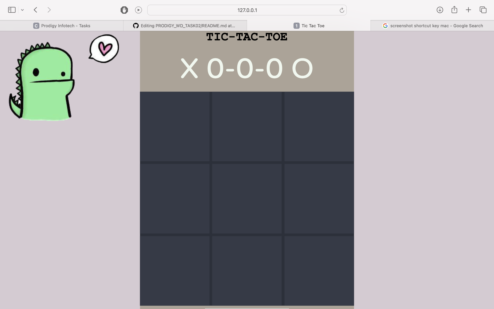

# Tic Tac Toe Web Application

Welcome to the Tic Tac Toe web application! This simple game is built using HTML, CSS, and JavaScript.

## Table of Contents

- [Demo](#demo)
- [Features](#features)
- [Technologies Used](#technologies-used)
- [Installation](#installation)
- [How to Play](#how-to-play)
- [Contributing](#contributing)
- [License](#license)

## Demo

## Features

- Classic Tic Tac Toe gameplay.
- Two-player mode.
- Responsive design for various screen sizes.

## Technologies Used

- HTML
- CSS
- JavaScript
